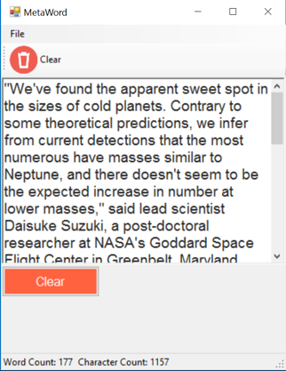

# CS-Forms-MetaWords
This application is a simple word counter and character counter.  The user enters text into the RichTextBox.  As the user enters or removes text from the textbox, the totals are immediately scored and displayed in the StatusStrip labels below the cancel button.  This calculation is executing during the RichTextBox's textChanged event.  The text is parsed into a string array to count the number of words.  To count the number of characters, a character array is used.
+
+ 
